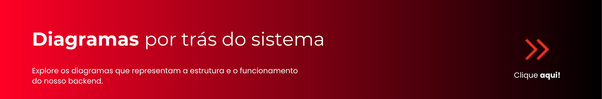

# Vitalitas - Backend API

> **API RESTful para gestão integrada de academias.**


> ℹ️ Para o contexto de produto (proposta de valor, escopo do MVP), acesse o **[README da Organização Vitalitas](https://github.com/VitalitasPJT)**.

<div align="center">

[](media/diagramas/)

</div>

## Pré-requisitos

* **[.NET SDK 9.0+](https://dotnet.microsoft.com/download)**
* Acesso ao **Azure SQL Database** do time — peça as credenciais a quem administra o Azure do projeto.
* Seu IP liberado no firewall do Azure SQL. Sem isso, todo comando abaixo falha por timeout.

## ⚠️ Banco compartilhado — leia antes de mexer em schema

Todo o time usa **a mesma instância do Azure SQL**. Migrations afetam todo mundo imediatamente:

* **Antes de dar `git push`** com uma migration nova, avise o time — outra pessoa pode ter uma mudança de schema em andamento.
* **Depois de todo `git pull`**, rode o comando `dotnet ef database update` do passo 3 (abaixo) de novo, para aplicar migrations que outra pessoa tenha adicionado. Pular esse passo pode quebrar sua aplicação local ou gerar uma migration duplicada/conflitante depois.
* Para gerar uma migration nova, após alterar uma entidade em `src/Domain/Features/**`:

  ```bash
  dotnet ef migrations add NomeDaMudanca --project src/Infrastructure/Vitalitas.Infrastructure.csproj --startup-project src/API/Vitalitas.API.csproj --output-dir Database/Migrations
  ```

## Como rodar

```bash
# 1. Restaurar as tools do repositório (dotnet-ef)
dotnet tool restore

# 2. Configurar segredos locais (connection string + chave JWT)
cd src/API
dotnet user-secrets set "ConnectionStrings:ConexaoPadrao" "Server={server}.database.windows.net,1433;Initial Catalog=sql-db-vitalitas;Persist Security Info=False;User ID={login};Password={your_password};MultipleActiveResultSets=False;Encrypt=True;TrustServerCertificate=False;Connection Timeout=30;"
dotnet user-secrets set "Jwt:Key" "SUA_CHAVE_SECRETA_LOCAL_COM_PELO_MENOS_32_CARACTERES"
cd ../..

# 3. Aplicar o schema ao banco (cria as tabelas via EF Core migrations)
dotnet ef database update --project src/Infrastructure/Vitalitas.Infrastructure.csproj --startup-project src/API/Vitalitas.API.csproj

# 4. Rodar a aplicação
dotnet restore
dotnet build
dotnet run --project src/API/Vitalitas.API.csproj
```

A API sobe em `https://localhost:7214` (HTTPS) ou `http://localhost:5156` (HTTP). Documentação interativa dos endpoints (Swagger): **`https://localhost:7214/swagger`**.

> Os segredos usam `dotnet user-secrets` (nunca em arquivo versionado) — detalhes em [ADR-0011](docs/adr/0011-adocao-user-secrets.md). `src/API/appsettings.Development.json.example` mostra o formato/chaves esperadas, só como referência.

## Arquitetura

Clean Architecture com quatro projetos (`Domain`, `Application`, `Infrastructure`, `API`). Acesso a dados usa **Dapper** em runtime e **EF Core** só para versionar/aplicar o schema (não para consultas). Detalhes completos e o histórico de decisões:

<div align="center">

[](docs/Arquitetura_backend.md)
[](docs/adr/README.md)

</div>

## Autenticação da API

JWT com access token (15 min) + refresh token (7 dias), via `POST /usuario/login` e `POST /usuario/refresh`. Fluxo completo, exemplos de request/response e guia de integração para o front-end: [`docs/Autenticacao_API.md`](docs/Autenticacao_API.md).

## Equipe Backend

* **Sanderson Machado** — *Gerente de Projeto / Tech Lead* — Arquitetura Backend, Definição de Backlog (PO) e Liderança Técnica.<br>
  [](https://www.linkedin.com/in/sandersonnexum)<br>
  [](https://github.com/sandersonnexum)

* **Hugo Matos** — *DBA / QA* — Modelagem de dados (DER/MER), Scripts SQL e Testes de Qualidade.<br>
  [](https://github.com/HugoFMat)<br>
  [](https://www.linkedin.com/in/hugo-ferreira-matos-265b0426b?utm_source=share_via&utm_content=profile&utm_medium=member_android)

* **Pedro Luis de Souza Abreu** — *Desenvolvedor Back-end* — Desenvolvimento de APIs, Regras de Negócio e Integração com Banco.<br>
  [](https://www.linkedin.com/in/pedro-luiz-abreu-90a849355/)<br>
  [](https://github.com/Pedrolsza)

## Licença

Projeto desenvolvido exclusivamente para fins acadêmicos na disciplina de **Projeto Integrador** do **Centro Universitário de Brasília (UniCEUB)**, atualizado no 7º semestre (09 de junho 2026).

Copyright © 2026 **Vitalitas**. Todos os direitos reservados.
